# Tailwind CSS Learnings

<div align="left">
  
    
  
  
  
        
  
</div>

###

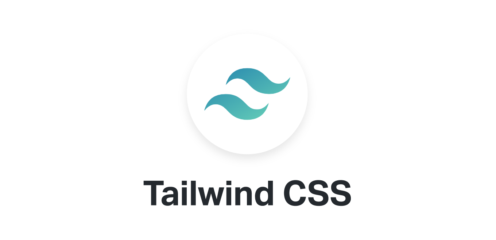

###

> Tailwind CSS é um framework CSS que permite criar rapidamente interfaces customizáveis. Em vez de fornecer estilos predefinidos para componentes como muitos frameworks , o Tailwind CSS oferece uma série de classes que podem ser combinadas para construir qualquer design diretamente no HTML

</div>

## ⚓ Mini projetos

<p>Desenvolvi esses 2 pequenos projetos usando Tailwind CSS durante um período de estudos</p>

<div align="left">

### Interface de um site de Hoteis e Resorts


</div>

### 🔗 Deploy

### Interface login League Of Legends


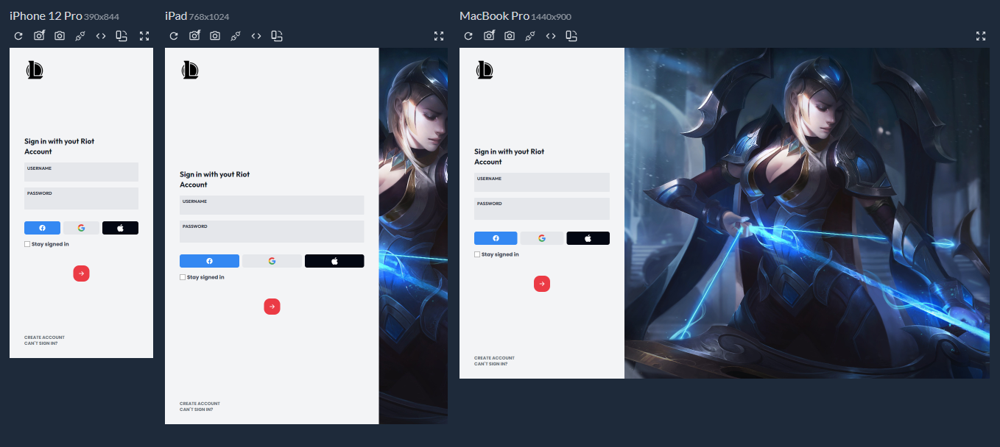
</div>

### 🔗 Deploy

<a href="#">Confira aqui o projeto</a>

## ⚓ Inline Style

<p>Umas das diferença entre o inline-style e o tailwind css são as limitações que o estilo em linha possui:</p>

<h4>Media Queries</h4>
<p>Inline styles não suportam diretamente media queries. Isso significa que não é possível aplicar estilos condicionais com base em tamanhos de tela ou outros critérios, algo que é crucial para o design responsivo.</p>

```
<!-- Isso não é possível com inline styles -->
<div style="background-color: red;">Conteúdo</div>
<!-- A media query não pode ser aplicada aqui -->
```

<h4>Estados como Hover e Focus</h4>
<p>Inline styles não permitem a aplicação de estilos baseados em estados de pseudo-classes como :hover, :focus, :active, etc.</p>

```
<div style="color: blue;">Texto</div>
<!-- Não é possível definir estilos para hover ou focus inline -->
```

<h4>Padronização</h4>
<p>Inline styles não fornecem uma forma eficaz de padronizar estilos em todo o projeto. Cada elemento precisa ter seus estilos definidos individualmente, o que pode levar a inconsistências e dificultar a manutenção.</p>

```
<div style="color: red; padding: 10px;">Texto 1</div>
<div style="color: red; padding: 10px;">Texto 2</div>
<!-- Cada elemento deve ter estilos repetidos manualmente -->
```

<p><strong>Tailwind CSS</strong> permite a criação de designs responsivos, a aplicação de estilos baseados em estados, e a manutenção de uma padronização consistente em todo o projeto.</p>

## ⚒️ Instalação

<h4>(JavaScript Vanilla)</h4>

### Crie um Projeto Vite

Crie um novo projeto Vite.

```
npm create vite@latest my-vite-project --template vanilla
```

```
cd my-vite-project
```

### Instalar Tailwind CSS

Instale Tailwind CSS e suas dependências:

```
npm install -D tailwindcss postcss autoprefixer
```

inicialize a configuração do Tailwind CSS:

```
npx tailwindcss init
```

Isso criará um arquivo `tailwind.config.js` na raiz.

### Configurar o Tailwind CSS

No arquivo `tailwind.config.js` configure os caminhos para todos os <strong>arquivos de modelo</strong>, adicionando dentro de `content`:

```
/** @type {import('tailwindcss').Config} */
export default {
  content: [
    "./index.html",
    "./src/**/*.{js,ts,jsx,tsx}",
  ],
  theme: {
    extend: {},
  },
  plugins: [],
}
```

### Configurar PostCSS

Crie um arquivo `postcss.config.js` e adicione:

```
export default {
  plugins: {
    tailwindcss: {},
    autoprefixer: {},
  },
}

```

### Adicionando Tailwind CSS ao CSS

No diretório `src`, crie um arquivo CSS `styles.css` e adicione:

```
cssCopiar código
@tailwind base;
@tailwind components;
@tailwind utilities;
```

Em seguida, importe este arquivo CSS no `main.js`.

```
import './styles.css';
```

### Rodando o Projeto

```
npm run dev
```

### Estrutura

```
project/
├── index.html
├── package.json
├── postcss.config.js
├── tailwind.config.js
├── src/
│   ├── main.js
│   └── styles.css
└── vite.config.js
```

## 🅰️ Tipografia

Usar a tipografia no Tailwind CSS é simples e flexível.

### Tamanho da Fonte (Font-size)

```
<p class="text-xs">Texto extra pequeno</p>
<p class="text-sm">Texto pequeno</p>
<p class="text-base">Texto padrão</p>
<p class="text-lg">Texto grande</p>
<p class="text-xl">Texto extra grande</p>
<p class="text-2xl">Texto 2x extra grande</p>
<p class="text-3xl">Texto 3x extra grande</p>
<p class="text-4xl">Texto 4x extra grande</p>
<p class="text-5xl">Texto 5x extra grande</p>
<p class="text-6xl">Texto 6x extra grande</p>
```

### Peso da Fonte (Font-weight)

```
<p class="font-thin">Fonte fina</p>
<p class="font-extralight">Fonte extra leve</p>
<p class="font-light">Fonte leve</p>
<p class="font-normal">Fonte normal</p>
<p class="font-medium">Fonte média</p>
<p class="font-semibold">Fonte semi-negrito</p>
<p class="font-bold">Fonte negrito</p>
<p class="font-extrabold">Fonte extra negrito</p>
<p class="font-black">Fonte preta</p>
```

### Espaçamento entre Letra (letter-spacing)

```
<p class="tracking-tighter">Espaçamento entre letras muito apertado</p>
<p class="tracking-tight">Espaçamento entre letras apertado</p>
<p class="tracking-normal">Espaçamento entre letras normal</p>
<p class="tracking-wide">Espaçamento entre letras largo</p>
<p class="tracking-wider">Espaçamento entre letras muito largo</p>
<p class="tracking-widest">Espaçamento entre letras máximo</p>
```

### Alinhamento de Texto (text-align)

```
<p class="tracking-tighter">Espaçamento entre letras muito apertado</p>
<p class="tracking-tight">Espaçamento entre letras apertado</p>
<p class="tracking-normal">Espaçamento entre letras normal</p>
<p class="tracking-wide">Espaçamento entre letras largo</p>
<p class="tracking-wider">Espaçamento entre letras muito largo</p>
<p class="tracking-widest">Espaçamento entre letras máximo</p>
```

### Cor do Texto (color)

```
<p class="text-red-500">Texto vermelho</p>
<p class="text-blue-500">Texto azul</p>
<p class="text-green-500">Texto verde</p>
<p class="text-gray-500">Texto cinza</p>
<p class="text-black">Texto preto</p>
<p class="text-white">Texto branco</p>
```

<h4>Documentação de tipografia completa:</h4>

<a href="https://tailwindcss.com/docs/font-family"></a>

> Clique no ícone para acessar

## ✒️ Cores

<p>Tailwind CSS vem com uma <strong>paleta de cores</strong> predefinida que cobre uma ampla gama de tons. Cada cor tem diferentes níveis de luminosidade</p>

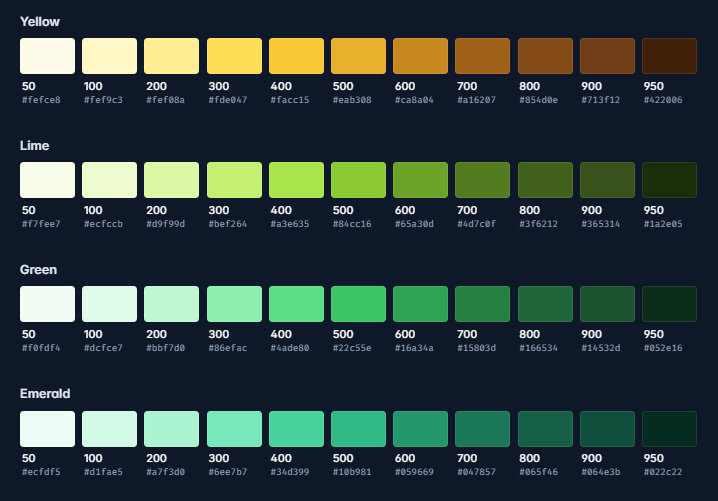

```
<div class="bg-red-500 text-white p-4">Red 500</div>
<div class="bg-green-500 text-white p-4">Green 500</div>
<div class="bg-blue-500 text-white p-4">Blue 500</div>
<div class="bg-yellow-500 text-black p-4">Yellow 500</div>
```

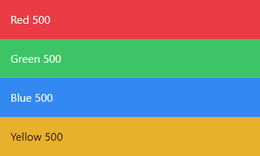

<h4>Documentação de cores completa:</h4>

<a href="https://tailwindcss.com/docs/font-family"></a>

> Clique no ícone para acessar

## ➡️ Spacing

<p>No Tailwind CSS, a margin, padding e os utilitários space-x e space-y são ferramentas essenciais para controlar o espaçamento entre elementos.</p>

### Margin

<h4>Margem única para todos os lados</h4>

```
<div class="m-4">Margem de 1rem em todos os lados</div>
```

<h4>Margem para um lado específico</h4>

```
<div class="mt-4">Margem superior de 1rem</div>
<div class="mr-4">Margem direita de 1rem</div>
<div class="mb-4">Margem inferior de 1rem</div>
<div class="ml-4">Margem esquerda de 1rem</div>
```

<h4>Margem para um lado específico</h4>

```
<div class="mx-4">Margem horizontal de 1rem (esquerda e direita)</div>
<div class="my-4">Margem vertical de 1rem (superior e inferior)</div>
```

### Padding

<p>Adicionar espaço interno dentro de um elemento.</p>

<h4>Padding único para todos os lados</h4>

```
<div class="p-4">Padding de 1rem em todos os lados</div>
```

<h4>Padding para um lado específico</h4>

```
<div class="pt-4">Padding superior de 1rem</div>
<div class="pr-4">Padding direito de 1rem</div>
<div class="pb-4">Padding inferior de 1rem</div>
<div class="pl-4">Padding esquerdo de 1rem</div>
```

<h4>Padding horizontal e vertical</h4>

```
<div class="px-4">Padding horizontal de 1rem (esquerda e direita)</div>
<div class="py-4">Padding vertical de 1rem (superior e inferior)</div>
```

### Espaçamento entre Elementos (space-x e space-y)

`space-x` e `space-y` são usados para adicionar espaçamento entre elementos filhos ao longo dos eixos horizontal e vertical, respectivamente

<h4>Espaçamento horizontal (space-x)</h4>

```
<div class="flex space-x-4">
  <div class="bg-red-500 p-4">Item 1</div>
  <div class="bg-green-500 p-4">Item 2</div>
  <div class="bg-blue-500 p-4">Item 3</div>
</div>
```

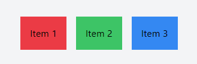

<h4>Espaçamento vertical (space-y)</h4>

```
<div class="space-y-4">
  <div class="bg-red-500 p-4">Item 1</div>
  <div class="bg-green-500 p-4">Item 2</div>
  <div class="bg-blue-500 p-4">Item 3</div>
</div>
```

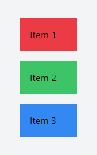

## 🪡 Bordas

<p>Você pode adicionar bordas a um elemento usando as classes border. Por padrão, isso adiciona uma borda de 1 pixel de largura com uma cor de borda padrão que é cinza</p>

```
<div class="border">
  Este elemento tem uma borda padrão.
</div>
```

### Largura da Borda

Para definir a largura da borda, você pode usar as classes `border-{tamanho/size}`

```
<div class="border-2">
  Este elemento tem uma borda de 2 pixels.
</div>
<div class="border-4">
  Este elemento tem uma borda de 4 pixels.
</div>
```

### Cor da Borda

Para mudar a cor da borda use a classe `border-{color}`

### Ring

O `ring` no Tailwind CSS é uma maneira de adicionar uma borda externa ao redor de um elemento, semelhante a uma borda, mas que fica fora do box model padrão do CSS

```
  <button
        class="bg-blue-400 font-semibold px-4 py-1 rounded text-white ring-2 hover:bg-slate-800"
      >
        SAVE
      </button>
```

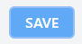

### Border Radius (rounded)

```
<div class="rounded-lg border border-gray-500 p-4">
  Borda arredondada uniformemente.
</div>
```

```
    <div class="m-5 p-4 border-2 border-red-400 rounded-md">
      <p>
        Lorem ipsum dolor sit, amet consectetur adipisicing elit. Aliquid
        ratione fuga, totam accusamus odio illo quidem corporis explicabo
        ducimus modi eius omnis praesentium itaque, perferendis reprehenderit
        nesciunt repudiandae maiores tempore!
      </p>
      <br />


      <button
        class="bg-blue-400 font-semibold px-4 py-1 rounded text-white ring-2 hover:bg-slate-800"
      >
        SAVE
      </button>
    </div>
```

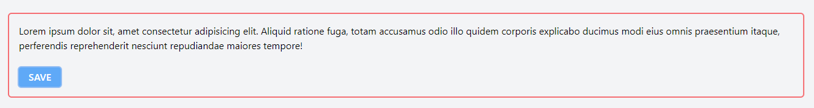

## 🤩 Background Image

Esta classe permite que você defina a imagem de fundo, ajuste seu posicionamento, tamanho, repetição e mais.

você pode usar a classe `bg-[url('path/to/image')]`

```
<div class="bg-[url('https://example.com/path/to/image.jpg')] h-64 w-full">
  Este elemento tem uma imagem de fundo.
</div>
```

Ou você pode adicionar suas próprias imagens de fundo editando a seção theme.backgroundImage do seu arquivo `tailwind.config.js`

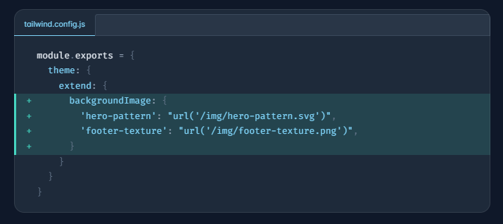

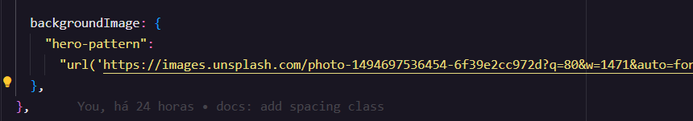

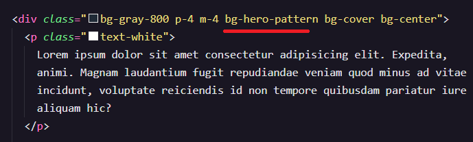

### Gradiente

```
<div class="h-14 bg-gradient-to-r from-cyan-500 to-blue-500"></div>
<div class="h-14 bg-gradient-to-r from-sky-500 to-indigo-500"></div>
<div class="h-14 bg-gradient-to-r from-violet-500 to-fuchsia-500"></div>
<div class="h-14 bg-gradient-to-r from-purple-500 to-pink-500"></div>
```

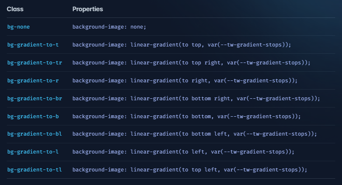

<h4>Documentação de background image completa:</h4>

<a href="https://tailwindcss.com/docs/background-image"></a>

> Clique no ícone para acessar

## 🏹 Flex

<p>P Display flex é implementado através de uma série de classes utilitárias que permitem criar layouts flexíveis e responsivos de maneira simples e eficiente. </p>

### Definindo um Contêiner

```
<div class="flex">
  <div>Item 1</div>
  <div>Item 2</div>
  <div>Item 3</div>
</div>
```

### Flex Direction

Você pode definir a direção dos itens flexíveis com as classes `flex-row`, `flex-row-reverse`, `flex-col` e `flex-col-reverse`.

```
<div class="flex flex-row">
  <!-- Os itens são organizados em uma linha (horizontalmente) -->
</div>
<div class="flex flex-col">
  <!-- Os itens são organizados em uma coluna (verticalmente) -->
</div>
```

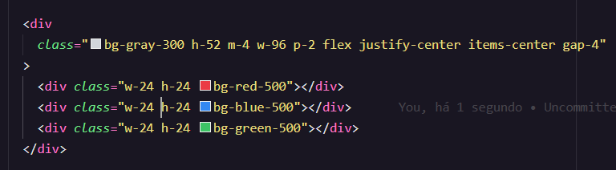

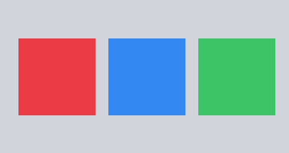

### Align Items

O alinhamento dos itens dentro do contêiner pode ser controlado com as classes `items-start`, `items-center`, `items-end`, `items-baseline` e `items-stretch`

```
<div class="flex items-center">
  <!-- Os itens são alinhados ao centro  -->
</div>
```

### Justify Content

A justificação do conteúdo pode ser feita com as classes `justify-start`, `justify-center`, `justify-end`, `justify-between`, `justify-around` e `justify-evenly`.

```
<div class="flex justify-between">
  <!-- Os itens são distribuídos com espaço igual entre eles -->
</div>
```

## 🦗 Display Grid

O display grid permite criar layouts de duas dimensões com colunas e linhas, proporcionando um controle preciso sobre a organização e o espaçamento dos elementos

### Contêiner Grid

```
<div class="grid">
  <div>Item 1</div>
  <div>Item 2</div>
  <div>Item 3</div>
</div>
```

### Colunas

Você pode definir o número de colunas do grid usando a classe `grid-cols-`

```
<div class="grid grid-cols-3 gap-4">
  <div class="bg-blue-500 p-4">Item 1</div>
  <div class="bg-green-500 p-4">Item 2</div>
  <div class="bg-red-500 p-4">Item 3</div>
</div>
```

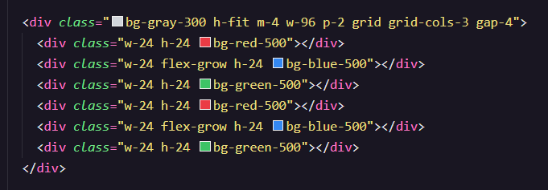

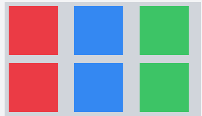

<h4>Documentação do display flex completa:</h4>

<a href="https://tailwindcss.com/docs/flex-basis"></a>

> Clique no ícone para acessar

## 🖱️ Hover, Focus, e outros States

<p> Permite que você aplique estilos a um elemento quando ele é apontado pelo cursor do mouse. Isso é útil para criar interações visuais e melhorar a experiência do usuário. </p>

```
<button class="bg-blue-500 hover:bg-blue-700 text-white font-bold py-2 px-4 rounded">
  Hover
</button>
```

As outras pseudo-classes funcionam basicamente da mesma forma `<nome da classe>: estilo a ser aplicado`

Neste exemplo, o botão terá um fundo azul (bg-blue-500) que mudará para azul escuro (bg-blue-700) quando o mouse passar sobre ele

### Group Hover

É uma funcionalidade poderosa que permite aplicar estilos a elementos filhos quando um elemento pai é "hovered". Essa característica é útil para criar interações mais complexas

Para usar o group-hover, você precisa de dois elementos principais:

<ul>
  <li>Um elemento pai com a classe group</li>
  <li>Um ou mais elementos filhos com a classe group-hover</li>
</ul>

```
<div class="group">
  <div class="bg-gray-200 p-4">
    Passe o mouse sobre mim
  </div>
  <div class="bg-blue-500 p-4 group-hover:bg-blue-700">
    Eu mudo quando você passa o mouse sobre o pai
  </div>
</div>
```

<h4>Documentação Handling Hover, Focus, and Other States</h4>

<a href="https://tailwindcss.com/docs/hover-focus-and-other-states"></a>

> Clique no ícone para acessar

## 💀 Dark Mode

O Tailwind CSS oferece suporte nativo ao Dark Mode através da classe `dark`

<h4>É muito simples de utiliza-lo:</h4>

Basta adicionar o prefixo `dark:` a uma classe de estilo

```
<div class="bg-white dark:bg-slate-800 rounded-lg px-6 py-8 ring-1 ring-slate-900/5 shadow-xl">
  <div>
    <span class="inline-flex items-center justify-center p-2 bg-indigo-500 rounded-md shadow-lg">
      <svg class="h-6 w-6 text-white" xmlns="http://www.w3.org/2000/svg" fill="none" viewBox="0 0 24 24" stroke="currentColor" aria-hidden="true"><!-- ... --></svg>
    </span>
  </div>
  <h3 class="text-slate-900 dark:text-white mt-5 text-base font-medium tracking-tight">Writes Upside-Down</h3>
  <p class="text-slate-500 dark:text-slate-400 mt-2 text-sm">
    The Zero Gravity Pen can be used to write in any orientation, including upside-down. It even works in outer space.
  </p>
</div>
```

<p> Dessa maneira , quando o <strong>Sistema</strong> ou o <strong>Navegador</strong> estiver no modo escuro , o estilo com o "dark:" vai prevalecer</p>

### Aplicando o modo dark manualmente

Se você quiser oferecer suporte à alternância manual do modo escuro em vez de depender da preferência do sistema operacional, use a estratégia de `selector` em vez da estratégia do `media`:

### No seu arquivo tailwind.config.js configure:

```
/** @type {import('tailwindcss').Config} */
module.exports = {
  darkMode: 'selector',
  // ...
}
```

Dessa maneira o modo escuro será ativado apenas quando a tag `HTML` estiver com a classe `dark`:

```
<!-- Mode escuro não ativado -->
<html>
<body>
  <!-- Will be white -->
  <div class="bg-white dark:bg-black">
    <!-- ... -->
  </div>
</body>
</html>

<!-- Modo escuro ativado -->
<html class="dark">
<body>
  <!-- Will be black -->
  <div class="bg-white dark:bg-black">
    <!-- ... -->
  </div>
</body>
</html>
```

## ✍️ Classes personalizadas

<p>No Tailwind CSS, você pode criar classes personalizadas para estender a funcionalidade padrão da biblioteca</p>

### Usando @apply para Componentes Personalizados

O `@apply` é uma diretiva do Tailwind que permite compor várias classes utilitárias em uma única classe CSS. Isso é útil para criar componentes reutilizáveis

### Configure seu main.css

```
@tailwind base;
@tailwind components;
@tailwind utilities;

.my-custom-style {
  /* ... */
}
```

### Crie suas classes personalizadas

```/* styles.css */
.btn-primary {
  @apply bg-blue-500 text-white font-bold py-2 px-4 rounded;
}

.btn-secondary {
  @apply bg-gray-500 text-black font-semibold py-2 px-4 rounded;
}
```

Aqui, duas classes (.btn-primary e .btn-secondary) foram criadas com estilos combinados. Agora, você pode aplicar esses estilos em qualquer elemento usando essas classes personalizadas.

### Criando Classes Personalizadas no CSS

Se você precisar de um controle mais refinado ou deseja adicionar estilos que o Tailwind não cobre, pode simplesmente escrever suas próprias classes CSS no arquivo de estilos.

```
.custom-shadow {
  box-shadow: 0 4px 6px -1px rgba(0, 0, 0, 0.1), 0 2px 4px -1px rgba(0, 0, 0, 0.06);
}

.custom-gradient {
  background: linear-gradient(to right, #ff7e5f, #feb47b);
}
```
